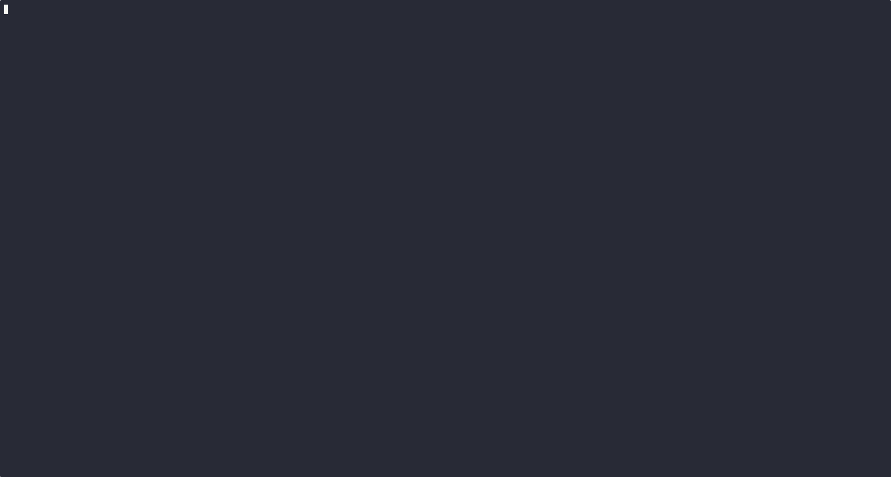
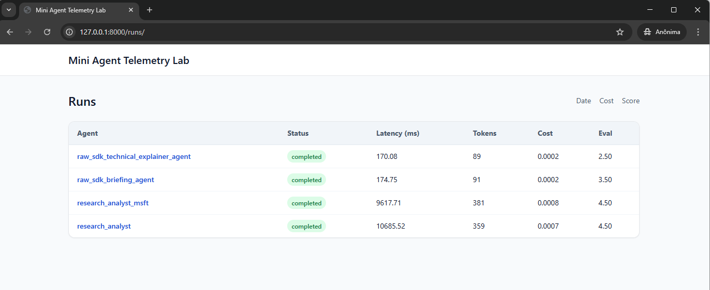
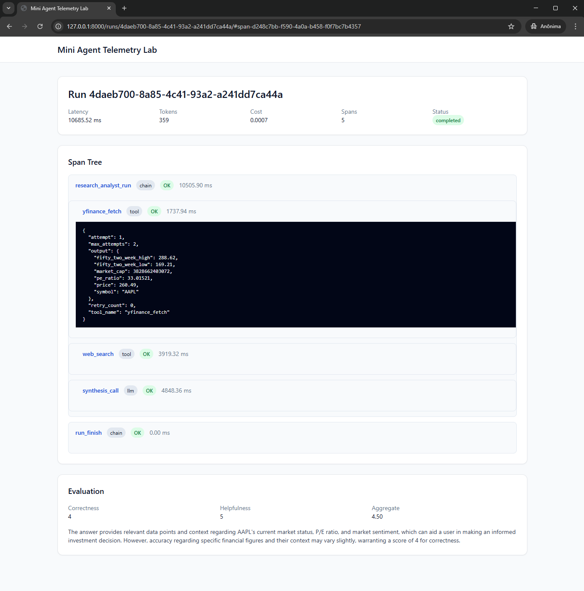

# Mini Agent Telemetry Lab

An observability backend that turns opaque LLM agent pipelines into structured, evaluated execution traces.

## 30-Second Skim

* **What it is:** A Django and PostgreSQL telemetry system that ingests, stores, and scores AI agent execution traces.
* **Why it matters:** AI agents fail unpredictably. This project moves debugging away from unstructured console logs into a queryable relational schema.
* **How it works:** A framework-agnostic Python tracer emits span data over HTTP to a backend that validates payloads strictly at the boundary before persistence.
* **Why it is credible:** The architecture guarantees operational resilience through idempotent ingestion, immutable run semantics, and durable asynchronous evaluation that persists failure states.

## Problem Statement

Most AI demo projects and initial generative AI deployments successfully generate text, but completely fail to explain *why* a response was slow, factually incorrect, or brittle. When an agent pipeline misbehaves, engineering teams are left sifting through unstructured console logs. Without structured span-level telemetry, teams cannot isolate whether system degradation stems from upstream model latency, a malformed tool execution payload, degraded prompt construction, or flawed orchestration logic. This observability gap prevents iterative quality improvement and turns maintenance into guesswork.

## Demo Workflow

The system generates inspectable evidence of execution steps, retries, timing, cost, and quality signals in one backend.







## Technical Decisions & Tradeoffs

The architecture demonstrates production reasoning under constraint. The system captures first, validates early, computes asynchronously, and preserves enough context to explain system behavior under failure.

| Tradeoff                           | Decision                                                      | Defensibility                                                                                                                                                                      |
| ---------------------------------- | ------------------------------------------------------------- | ---------------------------------------------------------------------------------------------------------------------------------------------------------------------------------- |
| **Latency vs. Consistency**        | Synchronous span POST in tracer and fail open on emit error.  | Keeps instrumentation simple. Ensures agent execution is never blocked by telemetry transport failures.                                                                            |
| **SQL vs. NoSQL**                  | Single SQL datastore with JSON fields.                        | Preserves relational tooling and query power while retaining flexible span payload schemas. Avoids the integration drag of a separate document database.                           |
| **Operational Simplicity**         | SqlHuey and PostgreSQL backend over Celery and Redis.         | Perfectly scoped for a portfolio project. It provides reliable queueing without massive infrastructure overhead. A documented production migration path exists in `core/tasks.py`. |
| **Strict Schema vs. Adaptability** | Fixed top level span fields plus a JSON `attributes` payload. | Protects core query patterns (tokens, cost) while allowing rapid evolution of model or tool metadata capture.                                                                      |

### Backend Best Practices

* **Boundary validation first:** DRF serializer rejects invalid telemetry payloads before DB writes.
* **Deterministic numeric handling:** Uses `Decimal` for cost math to avoid floating point drift.
* **Separation of concerns:** Ingestion, finalization, evaluation, and rendering are isolated in distinct modules.
* **Explicit ingestion semantics:** duplicate ingestion is idempotent and completed runs are immutable.
* **Error observability:** Span exceptions are marked as `ERROR`. The exception message is stored in span attributes rather than failing silently.
* **Durable async failure evidence:** evaluation failures are persisted for inspection instead of being silently dropped.

---

## Quick Start

Get the system running in 4 steps:

1. **Clone & Configure**
   ```bash
   git clone https://github.com/aluiziolira/mini-agent-telemetry-lab.git
   cd mini-agent-telemetry-lab
   cp .env.example .env
   ```
   *Edit `.env` to add your `LLM_API_KEY` and `INGEST_API_KEY`.*

2. **Sync the Environment**
   ```bash
   uv sync --dev
   ```

3. **Initialize the Stack** (DB, migrations, web container)
   ```bash
   just init
   ```

4. **Run the Demo** (Spawns agents, runs evals, verifies data)
   ```bash
   just demo
   ```

Then open http://localhost:8000/runs/ to see your telemetry.

If you want Django admin access, create a superuser explicitly:

```bash
uv run python manage.py createsuperuser
```

### Daily Development Workflow

```bash
just sync      # Sync the uv-managed virtualenv
just start     # Start the stack
just demo      # Generate sample telemetry
just test      # Run tests inside the project virtualenv
just logs      # Watch what's happening
just stop      # Shutdown when done
```

### Available Recipes

Run `just --list` to see all 20+ available recipes:

| Recipe                     | Purpose                                                                |
| -------------------------- | ---------------------------------------------------------------------- |
| `just init`                | First-time setup (DB → migrations → web)                               |
| `just start`               | Start the full application stack                                       |
| `just stop`                | Stop all containers cleanly                                            |
| `just demo`                | Complete demo cycle (agents + evals + verify)                          |
| `just agent`               | Run research_analyst agent (live tools + LLM)                          |
| `just agent-msft`          | Run research_analyst_msft agent (Microsoft research, live tools + LLM) |
| `just raw-agent`           | Run raw_sdk_briefing_agent (rule-based)                                |
| `just raw-agent-technical` | Run raw_sdk_technical_explainer_agent (technical question, rule-based) |
| `just status`              | Health check for containers + app                                      |
| `just verify`              | Verify data integrity                                                  |
| `just test`                | Run pytest test suite                                                  |
| `just logs`                | Stream container logs                                                  |


## Configuration

The application validates its environment on startup and fails fast if required settings are missing or invalid.

Required variables:
* `DJANGO_SECRET_KEY`: Cryptographic signing key.
* `INGEST_API_KEY`: Authentic key required for span ingestion.
* `DATABASE_URL`: PostgreSQL connection string.
* `EVAL_LLM_PROVIDER`: Evaluator model provider (defaults to `openai`).
* `LLM_API_KEY`: Required only if the chosen evaluation provider needs one.

Use non-placeholder values in your local `.env` (the app rejects `REPLACE_ME...` and `changeme...` values for required secrets).

Optional overrides:
* `DEBUG`: Defaults to `False`. When `False`, `ALLOWED_HOSTS` must be explicitly provided.
* `ALLOWED_HOSTS`: Comma-separated list of permitted hostnames.

### Security Notes for Public Repos

* Keep `.env` local-only (never commit real keys).
* Docker ports are bound to localhost by default for safer local demos.
* Console telemetry logging is metadata-only (span identifiers and attribute keys), not full prompt/output payloads.


## Architecture & Data Model

This project optimizes for engineering signal density and iteration speed. I chose a Django monolith with DRF ingestion to enforce schema boundaries at ingress.

* **Data Model:** An OTel inspired telemetry model maps `Run` (trace) and `Span` (step). A single SQL datastore with a JSON field on `Span.attributes` balances relational guarantees (indexes, transactional integrity) with telemetry flexibility (variable tool and LLM payloads).
* **Ingestion Boundary:** DRF serializers validate incoming spans before persistence. They reject malformed payloads before they reach storage (`core/serializers.py`, `core/views.py`).
* **Asynchronous Quality Loop:** The system evaluates completed runs with an LLM judge, stores explainable scores, and persists evaluation lifecycle evidence for success and failure paths (`core/tasks.py`, `core/models.py`).
* **Queueing Choice:** I use **SqlHuey** for the asynchronous evaluation path. Ingestion persists spans first, and a SqlHuey worker later computes quality scores. This is the correct queue choice here. It cuts infrastructure overhead for a portfolio-scale system by reusing the PostgreSQL database, eliminating the need for a separate Redis or RabbitMQ instance.
* **Framework Agnostic Instrumentation:** A custom Python tracer emits spans over HTTP without Django coupling. This allows usage from non-Django agent clients (`sdk/tracer.py`).

## Failure Modes I Designed For

A telemetry system is only useful if it behaves predictably when things go wrong. This project explicitly handles and tests several failure modes:

| Failure Mode                         | Behavior                                                      | Why It Matters                                                              |
| ------------------------------------ | ------------------------------------------------------------- | --------------------------------------------------------------------------- |
| Duplicate ingestion request          | Idempotency key prevents duplicate span persistence           | Protects metrics and run history from replay drift                          |
| New span after run completion        | Rejected with `409` and no run mutation                       | Makes completion semantics explicit and stable                              |
| Telemetry transport error from agent | Tracer fails open and agent execution continues               | Observability should not break primary workload execution                   |
| Hook callback failure                | Span ingestion still succeeds; hook error is logged           | Optional extension points should not compromise ingestion durability        |
| Evaluation JSON parse failure        | Failure state is persisted on the `Evaluation` record         | Background failures remain queryable instead of silently disappearing       |
| Evaluation provider exception        | Failure evidence, timestamps, and error message are persisted | Makes async debugging operationally tractable                               |
| Error spans inside a run             | Run can still complete and be evaluated                       | Real systems degrade; they do not require perfect runs to remain observable |

## Validated Technical Capabilities

The project includes an automated test suite verifying both domain logic and operational resilience, tailored to demonstrate production-ready problem solving.

| Implementation Detail           | Evidence                                                      | Why It Matters for Production                                                                                             |
| :------------------------------ | :------------------------------------------------------------ | :------------------------------------------------------------------------------------------------------------------------ |
| **Atomic Idempotent Ingestion** | `tests/test_ingest_semantics.py`                              | Prevents duplicate telemetry writes during agent retry or network replay scenarios, ensuring data integrity.              |
| **Immutable Run Semantics**     | `tests/test_lifecycle.py`, `tests/test_ingest_semantics.py`   | Locks telemetry after finalization while maintaining stable token/cost rollups, preventing mutation drift.                |
| **Durable Async Failures**      | `tests/test_evaluation.py`, `tests/test_failure_tolerance.py` | LLM evaluation failures are caught and persisted as queryable state, not lost in silent background crashes.               |
| **Deterministic Cost Rollups**  | `core/services/finalization.py` (Decimal math)                | Calculates agent financial cost reliably, avoiding floating-point errors common in naive estimations.                     |
| **Hierarchical Trace Assembly** | `tests/test_lifecycle.py`                                     | Successfully reconstructs N-depth parent/child execution graphs, enabling precise root-cause analysis for agent failures. |

## Demo Agents

There are four small agent entry points that share the same tracer boundary and ingestion path:

```bash
just agent
just agent-msft
just raw-agent
just raw-agent-technical
```

* `scripts/demo_agent.py` shows a richer research flow with live tools and an LLM call.
* `scripts/demo_agent_msft.py` adds a second company briefing flow for Microsoft using the same live-tool pattern.
* `scripts/raw_sdk_agent.py` is a standalone hand-rolled Python agent that uses the same `sdk.tracer.Tracer` directly and still posts spans to `/api/v1/ingest/span/`.
* `scripts/raw_sdk_technical_agent.py` adds a second raw SDK workflow for technical-question explanations using the same telemetry boundary.

That side-by-side contrast is the framework-agnostic proof: multiple agent styles and scenarios, one telemetry pipeline.

## Production Next Steps

If this were expanded beyond portfolio scope, the next steps would be:

- replace in-memory rate limiting with a shared backend
- move from SqlHuey to a more elastic queue only when throughput justifies it
- add tenant-aware auth and isolation for multi-user ingestion
- extend metrics and dashboards for queue latency and evaluator health
- add retention and archival policies for long-lived telemetry data

I intentionally did **not** build those here because the current design is optimized for clarity, correctness, and defensible tradeoffs at demo scale.
